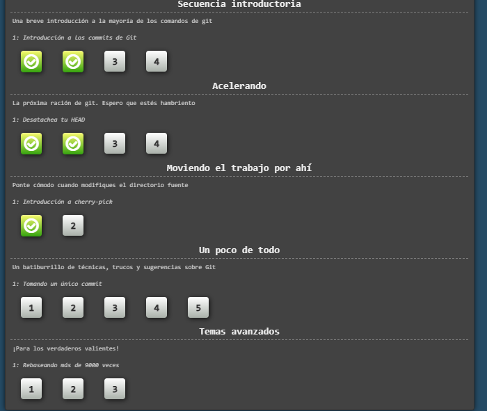
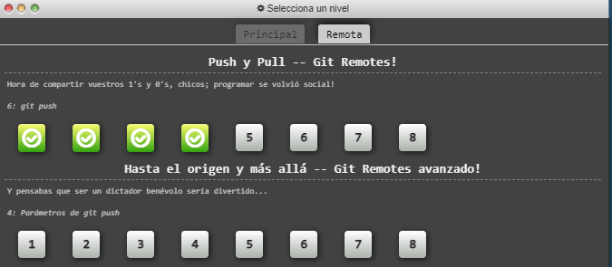

# Hola mi nombre es Julian

tengo 21 años, Estudiante del programa de ingeniería de sistemas, Graduado de educación media en el Gimnasio el lago. Fanatico del futbol y del Freestyle, tengo interes en aprender nuevas cosas en mi vida, para asi construir mi proyecto. Demuestro la importancia de un esfuerzo previo para lograr un objetivo, tengo mente de soñador.


## frase favorita
> *“Sólo una cosa vuelve un sueño imposible: el miedo a fracasar” Paulo Coelho, escritor.*


**Hincha de atletico nacional**


## Linkedin

[Julian Castillo](https://www.linkedin.com/in/julian-castillo-118856216/)


* Lenguajes usados
	- Java
	- Phyton
	- JavaScript


* Paises que quisiera conocer
	1. Noruega
	2. Alemania
	3. Corea del sur


## Algoritmo favorito, Algoritmo de Dijkstra

### Pseudocodigo

```

   DIJKSTRA (Grafo G, nodo_fuente s)       
       para u ∈ V[G] hacer
           distancia[u] = INFINITO
           padre[u] = NULL
           visto[u] = false
       distancia[s] = 0
       adicionar (cola, (s, distancia[s]))
       mientras que cola no es vacía hacer
           u = extraer_mínimo(cola)
           visto[u] = true
           para todos v ∈ adyacencia[u] hacer
               si ¬ visto[v]      
                   si distancia[v] > distancia[u] + peso (u, v) hacer
                       distancia[v] = distancia[u] + peso (u, v)
                       padre[v] = u
                       adicionar(cola,(v, distancia[v]))
```







